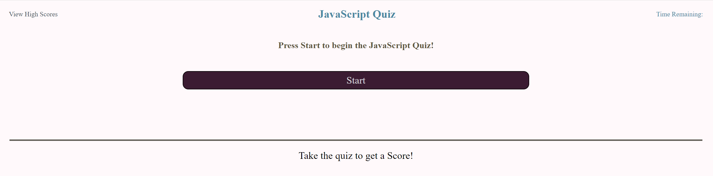
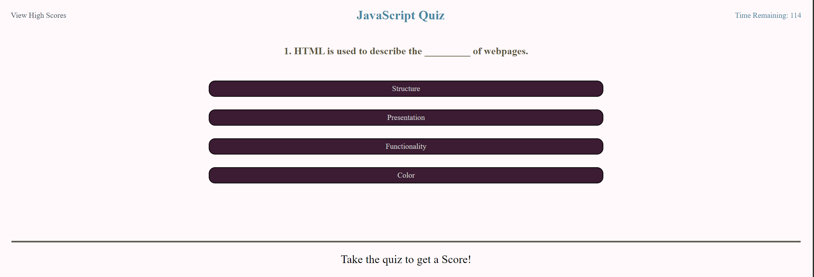
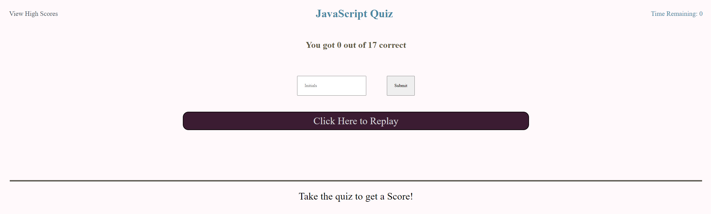

# Javascript Coding Quiz

## Description

This website contains a timed multiple choice quiz for evaluating knowledge on Javascript fundamentals. The quiz will store data locally so that the user can keep track of scores over attempts. Coding the website helps me familiarize myself with javascript Web API's and Javascript fundamentals.

## Installation

N/A

## Usage

To use the quiz, press the start button and answer the multiple choice questions.

The screen should be redirected to the first question. Answer the question by selecting the choice that best fits the question text.

Each question that is answered incorrectly will subtract 5 seconds from the timer in the top right corner of the screen. If the timer hits 0 or when all the questions have been answered, the quiz will redirect to the form submit screen.

Click on the submit button to enter your initials into the webpage. The webpage will store the data until the browser has been exited.

If it the first time taking the quiz, the footer will update from "Take the quiz to get a Score" to the initials of the last high score holder's initials and the current high score.

Click the replay button to refresh the quiz.

## Credits

N/A

## License

MIT License. Please refer to the LICENSE in the repo.

## Badges

